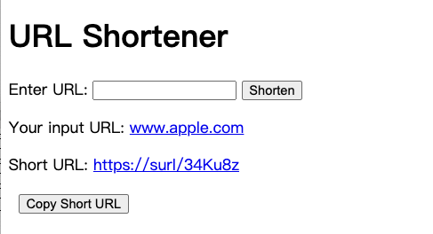

# ShortURL

This is a server for generating short URL. Users first provide their original long URL and this API generate a shorter one for users. Later on, users can use this URL to visit their origin website.

## Key techniques used
- **Framework**: FastAPI
- **Database**: MongoDB
- **Container**: Docker
- **Unit test**: pytest

## Features
- Enter long URL and generate short URL
- Use short URL to redirect to long URL
- Copy the generated short URL

## Prerequisite
If you run this app locally, you will need follow the installation: [MongoDB](https://www.mongodb.com/docs/manual/installation/). After downloading, I use macOS as an example:

1. Start MongoDB
```bash
brew services start mongodb-community
```

2. Stop MongoDB
```bash
brew services stop mongodb-community
```

## Installation
1. Clone this repository
   ```bash
   git clone https://github.com/ferygood/shortURL.git
   cd shortURL
   ```
2. Create a virtual environment and install dependencies
   ```python
   python -m venv venv
   source venv/bin/activate
   pip install -r requirements.txt
   ```

## How to use
Run the app
```bash
uvicorn main:app --reload
```

After running the app, you can paste [http://127.0.0.1:8000/](http://127.0.0.1:8000/) in your browser:


you can also use tools such as cURL to interact with the api
For example:
```bash
curl -X POST "http://localhost:8000/api/shorten" -H "Content-Type: application/json" -d '{"long_url": "https://www.google.com"}'

```
use the shorten url. Let says you receive a short URL: abcd123,
```bash
curl -X GET "http://localhost:8000/abcd123"
```
